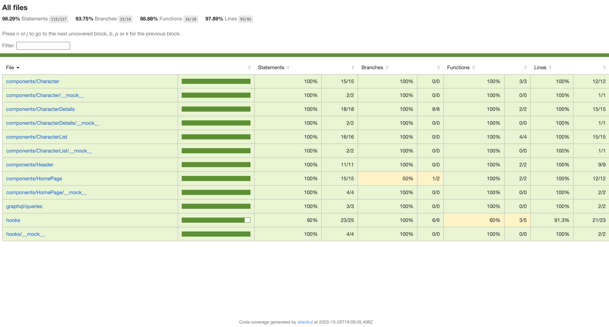

## Getting Started

PreRequisite:

1. Yarn Should be globally installed
2. NodeJs should be installed latest > 18+

**To run the development server:**

```
yarn dev
```

Open [http://localhost:3000](http://localhost:3000) with your browser to see the result.

**To run the storybook component server:**

```
yarn storybook
```

Open [http://localhost:6006](http://localhost:6006) with your browser to see component library

**To run the test cases:**

```
yarn test
```

### Tech Stack Involved:-

**Language:** Typescript

**Framework:** NextJs, ReactJs

**Component Library:** Storybook

**Testing:** Jest, React Testing Library

**Styling:** Styled Components

**UI Library:** Material UI

**State Management:** Apollo Client

**Responsive Design:** Responsive Design

**Linting:** Eslint, Prettier

**GraphQL:** GraphQL

**Package Dependency Manager:** Yarn

**Deployment:** Vercel

### Test Coverage Report Screenshot


